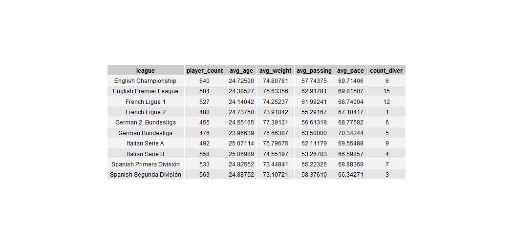

# Fifa League Prediction

## Background

It is widely accepted that football (soccer) is the most popular sport worldwide.
There are many countries around the world in which football is an essential part of
national culture. Generally, issues surrounding the sport are heavily debated. In recent years, there have been many discussions on the different styles of football played in
the different European top-leagues and the ideal physical attributes and skills for the
various positions in each league. To shed some light on this topic, I used the Fifa '18  Dataset from Kaggle and tested a few machine learning algorithms with the goal of predicting the league affiliation of a player based on their physical attributes and their individual skills. Here, the goal was not to define which league is outlined by which specific set of skills and physical attributes but rather to see *if* there are underlying features that allow a classification of playeres.

## Description of Data / Data Exploration

As mentioned earlier, I worked with a dataset extracted from the FIFA '18 computer game containing information on 17,994 football players across 42 leagues. There is a total
of 185 variables to describe each player that can be roughly grouped into three
categories:

1. General information (name, club, age, league, wage,market value)
2. Physical attributes (height_cm, weight_kg, body_type)
3. Skill evaluation (overall, passing, shooting, pace, phisical, ... )

The following table displays a selection of the variables included in the data set.

Note that variables like `age`, and `weight` are numerical, while variables like `diver_trait` (summarized in 'count_diver') are binary variables. The dataset consists of ~80 numerical and ~80 binary variables.

Cosidering the amount of features contained a single graph could not attempt to display all relationships among features in the different leagues. I have developed a shiny app (for our data-viz class) that lets the user discover the relationship of different player-attributes. Click [here](https://akleefel.shinyapps.io/fifa_viz_app/) to check out the app.

As another example of displaying the differences between certain variables across different leagues I have plotted the `height` variable below. When running our model, we hope that these differences across all variables are enough to allow classification.

## Approach

#### Sample and Initial Feature Selection

To increase the chance of getting meaningful results and to facilitate the task of classification, I limited the number of leagues to the first 2 tears of the five largest European football nations (Enland, France, Spain, Italy, and Germany). This **reduced the number of players included in the analysis to 5314**. Further, to get unbiased results based on only skill and physical attributes I removed features that trivially indicate league affiliation (i.e. `nationality`, `club`) or are irrelevant in the context of the question asked (`wage`, `market_value`, ...). This way I **reduced the amount of features included to 165**.

#### Models Considered (Parameter and Feature Adjustments)

* Random Forest

Using all available features, I ran a random forest and tuned the hyper-parameters using grid search cross-validation. This model ranked second in the most successful at classifying players into the different leagues. The ideal combination of hyperparameters was: `max_depth`: 10, `max_features`: 70, `n_estimators`: 13

This lead to a **classification accuracy of 0.2989.**

* Knn

Using all available features, I ran knn and tuned the hyper-parameters using grid search cross-validation. Cross validation suggested `n_neighbors`: 13 and a **cross-val accuray of:  0.183**

Knowing about the difficulty introduced by using binary and numerical features in distance-based models, as well as the "curse of dimensionality" for knn with a large number of features, I attempted to decrease the amount of features **using an association approach** (implemented in scikit-learn as `SelectKBest`).

After finding the optimal number of features to use based on cross validation the*performance of the algorithm **improved by an almost insignificant amount to 0.185**

* SVM

Using all available features, I used a support vector machine algorithm and tuned the hyper-parameters using radomized-search cross-validation. Cross validation suggested `gamma`: 0.000488, `C`: 16 leading to a **cross-val accuray of:   0.3410**  Making this the best-performing algorithm on this task.

Again, I attempted to decrease the amount of features  **using an association approach** (implemented in scikit-learn as `SelectKBest`) to find the features that are individually most correlated with the target variable. Cross-validation indicated that including 75 features would be a good bet. Using the 75 "best features" as well as the ideal hyper-parameters found above lead to a tiny increase in accurary to 0.3433.

## Result Summary

|Model|Paramters|Best CV Score|
|---|---|---|
|Random Forest|`max_depth`: 10, `max_features`: 70, `n_estimators`: 13|0.2989|
|knn|`n_neighbors`: 13|0.185|
|SVM|`gamma`: 0.000488, `C`: 16|0.3433|

#### Reflection

Trying to classify football players into 10 different leagues based on their physical attributes and skill evaluation proved to be more difficult than expected. With a random assignment, we could have achieved 10% accuracy and the best algorithm used in this project barely made it across the 30% mark.

Further, I have to note that 5 of the 10 leagues included are second-tier leagues. Potentially, the model can differentiate between players that play at top-level and the players that play at the second level. Considering this would make our accuracy score even less impressive since a random guess of within-level classification would yield the correct results 20% of times.

**Note** Due to time limitations, I was not able to re-run my analysis using only top-tear teams to account for the above underlying logical problem - but I will do so as soon as I get the chance! Further, I will consider other ensemble methods that I have not tried yet. s
